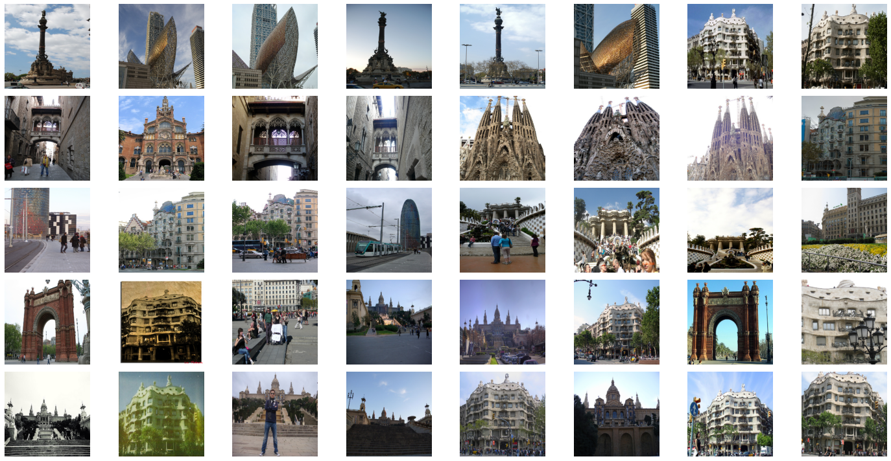

# Image Sorting with Generative model

Generative model such as AE or GAN create a latent space which holds compressed image representations. It's numerical data and one-to-one correspondent with the input images. In image sorting, the latent space info is used as dictionary data where key is image and value is numerical data of latent space. Images are sorted by calculating the distance of latent space info.

In this notebook, the image sorting process is introduced.

`Image Sorting Steps`

1. Make generative model learn how to generate input data $\mathbf{I}$.
2. Inputs all images to the encoder and gets latent variables outputs $\mathbf{z}$.
3. Make image-variables Dictinary $\mathbf{D_{img-z}}$.
4. Decide one reference image and calculate the distance.
5. Images are sorted by the distance.

## Data
Dataset: [European Cities 1M dataset](http://image.ntua.gr/iva/datasets/ec1m/index.html) [1] is used to see  how proposed method works in image sorting.

#### Examples

## Results Example

As a example, AE compresss the land scape images and gets latent space info. The info is so high dimentional that Umap is applied to get informative and low dimentional infos. Left image shows the two dimentional latent space info. Based on it, images are sorted. Right image is showing the image-sorting result.

## Files

- **`ImageSorting.ipynb`** : You can run through the process of sorting the images and see the results.

- **`model.py`** has AE and VAE models.
- **`utils.py`**

### Trained model

- `ae_encoder_mse.h5`: the encoder of trained AE model with **MSE** loss.

- `ae_encoder_mae.h5`: the encoder of trained AE model with **MAE** loss.

## Reference

[1] Y. Avrithis, Y. Kalantidis, G. Tolias, E. Spyrou. Retrieving Landmark and Non-Landmark Images from Community Photo Collections. In Proceedings of ACM Multimedia (MM 2010), Firenze, Italy, October 2010.